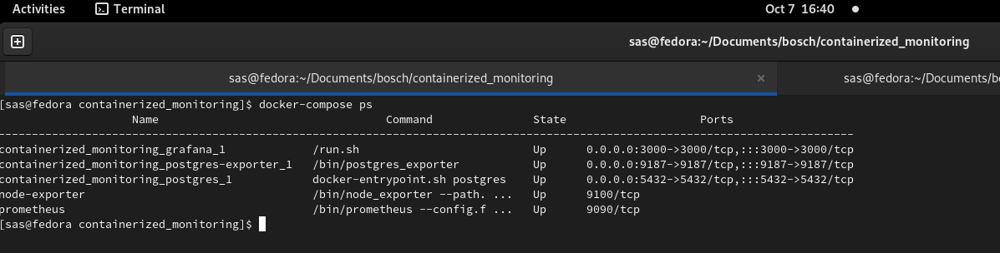
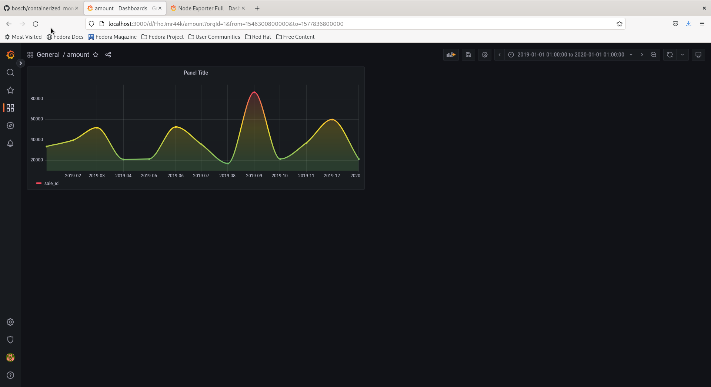
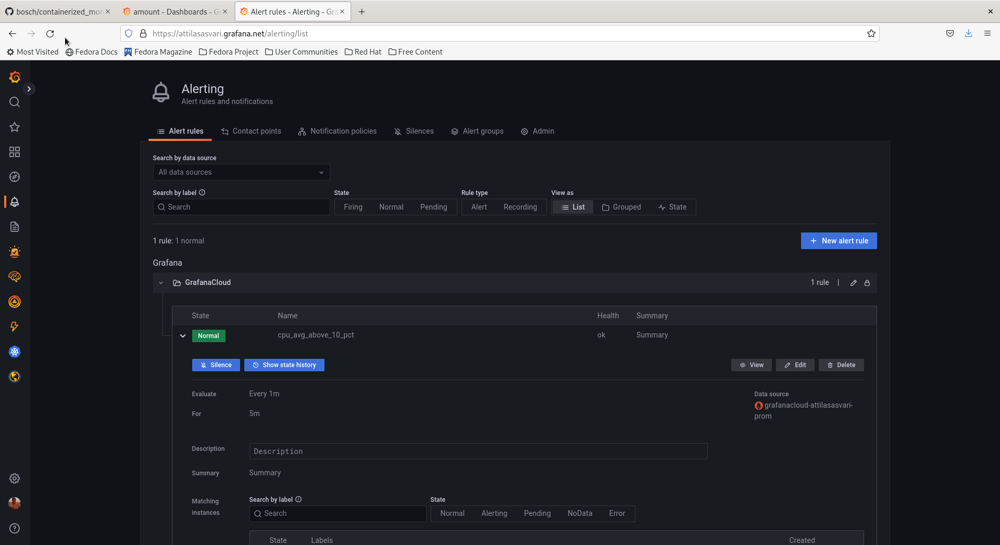

# Containerized Monitoring Environment

This project includes `docker-compose.yml` which spins up the following services:
- Grafana
- Prometheus
- Postgres
- postgres-exporter
- node-exporter

It also includes `prometheus.yml` to scrape the Linux node and the Postgres instance.

A Grafana dashboard with the help of a public plugin was setup for the Linux Node.

The dockerized Grafana instance is connected with PostgreSQL and one panel was added that visualizes a time series data.

__This project was inspired by Grafana website's Quickstarts page.__

## Reasoning behind the selection of the services

The main logic behing selecting the above listed services (e.g., node-exporter, Prometheus, Grafana) boils down to the following factors:
- due to the available time to solve this challenge, I selected services I have already met before during my studies and practices.
- the available documentations.

## Screenshots

`docker-compose ps`

Linux node dashboard on remote Grafana

Postgres on dockerized Grafana

Some basic alert

